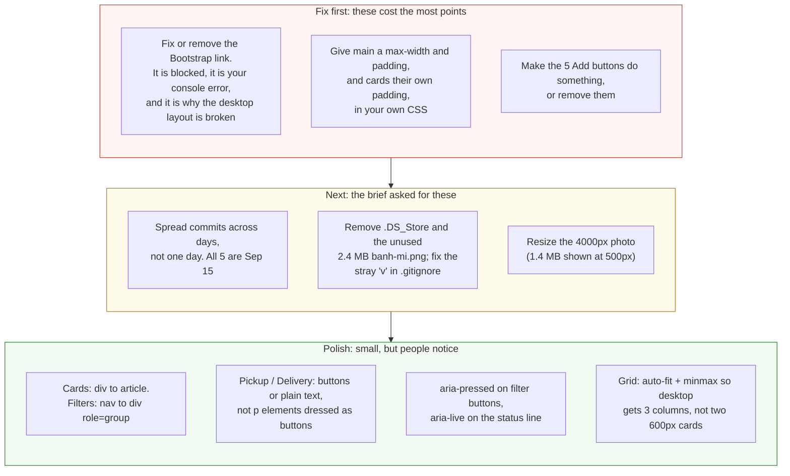

# Project 1: Static Foundations — Feedback

**Student:** Josh Caili · **Repo:** [joshcaili/CSC436](https://github.com/joshcaili/CSC436) · **Live:** [joshcaili-proj1.netlify.app](https://joshcaili-proj1.netlify.app/)
**Reviewed at commit:** `1e55cf0` · **Course:** CSC 436, Fall 2026

> **How this review was made.** Your instructor reviewed this project with [Claude](https://claude.com) (Anthropic's AI) as a second set of eyes. Claude cloned the repo, read every line, loaded the live site at phone, tablet and desktop widths, ran the W3C validator, read the browser console, and clicked every filter button and every Add button. Every note and every point below was read and approved by your instructor. Same standard, same rubric, just more time spent looking at *your* code than one human has in a grading week.

## Grade: 77 / 100

| Category | Points | Earned | One line |
|---|:-:|:-:|---|
| Semantic HTML | 20 | 16 | Valid, clean outline, great alt text; cards are `div`s, two fake buttons, a `nav` with no links |
| CSS layout | 25 | 18 | Flexbox and Grid both yours and both purposeful; spacing depends on a stylesheet that never loads |
| Responsive design | 15 | 13 | Mobile-first (the only one so far), no horizontal scroll; desktop is just tablet, wider |
| JavaScript interaction | 15 | 12 | Filter is clean and idiomatic; one console error on load; five Add buttons do nothing |
| Repository and deployment | 15 | 11 | README complete, deploy works; all commits on the due date, junk files committed |
| Content and polish | 10 | 7 | Real restaurant, real menu, real photo; desktop layout looks unfinished |
| **Total** | **100** | **77** | **Tight, correct fundamentals. One typo is quietly wrecking the layout.** |

## The short version

The bones here are right. Your outline is one `h1`, then `h2` per category, then `h3` per item, and the validator has nothing to say. You wrote your own Flexbox and your own Grid, your media query is mobile-first (nobody else in the class did that), the filter JavaScript is the cleanest I've read this week, and the README has everything the brief asked for.

Now open the browser console on your live site. There's one red line: the Bootstrap stylesheet is blocked. The `integrity` hash on [line 10](https://github.com/joshcaili/CSC436/blob/1e55cf0/index.html#L10) has three characters pasted twice, so the browser refuses to load the file. That means every Bootstrap class on your page, `container`, `p-3`, `py-4`, `mb-3`, does nothing. Your page has no max-width, so on a desktop it runs edge to edge. Your cards have zero padding, so the text touches the border. It's the console error the rubric mentions, and it's the reason the desktop looks unfinished. One typo, three categories.

## What the numbers looked like

Things Claude measured (so you know these aren't guesses):

| Check | Result |
|---|---|
| Horizontal scroll at 375 / 768 / 1280 px | None at any width |
| Console errors | 1: Bootstrap CSS blocked, integrity hash mismatch |
| Bootstrap stylesheet loaded | No |
| `.menu-card` computed padding | 0px (the `p-3` class never applied) |
| `main` computed max-width | none (the `container` class never applied) |
| W3C HTML validator | 0 errors, 0 warnings |
| Heading order | h1 → h2 → h3, no skipped levels |
| Filter buttons | All 5 work; sections hide and show, status line updates |
| Add buttons | 5, no click handler, nothing happens |
| Links on the page | 0 |
| Media query | 1, `min-width: 700px` (mobile-first) |
| Images | 1 used (4000×2250, 1.4 MB, shown at 500px); 1 committed and never referenced (2.4 MB) |
| Commits | 5, all on Sep 15 between 2:34 AM and 11:03 PM |

---

## Semantic HTML — 16 / 20

**What's working**

- `header`, `main`, `nav`, five `section`s, `footer`. One `h1` ([L21](https://github.com/joshcaili/CSC436/blob/1e55cf0/index.html#L21)), `h2` per category, `h3` per item. No skipped levels. Zero validator messages.
- The alt text on the photo ([L24](https://github.com/joshcaili/CSC436/blob/1e55cf0/index.html#L24)), "Vietnamese rice, spring rolls, noodles, and fresh vegetables served on plates," is a real description. Most alt text in this class is two words.
- `data-category` on each section and `data-filter` on each button is the right way to connect markup to behavior.

**What to change**

- **Menu cards are `div`s** ([L39](https://github.com/joshcaili/CSC436/blob/1e55cf0/index.html#L39) and four more). Each card is a self-contained item with its own heading, description and price. That's the textbook definition of `article`.
- **Pickup and Delivery are paragraphs dressed as buttons** ([L23](https://github.com/joshcaili/CSC436/blob/1e55cf0/index.html#L23)). Green pills that don't respond to anything. Either make them `button`s that toggle a state, or make them plain text ("Pickup or delivery available"). Don't make something look clickable if it isn't.
- **Five Add buttons with no handler.** Same principle. A `button` is a promise. Wire them up or remove them until they work.
- **`nav` holds filter buttons, not navigation** ([L27–33](https://github.com/joshcaili/CSC436/blob/1e55cf0/index.html#L27-L33)). `nav` means "links to other places." A filter bar is a toolbar: `<div role="group" aria-label="Filter menu">`. And your page has zero `a` elements anywhere, which is unusual for something called a nav.

  ```mermaid
  flowchart TB
      subgraph now["Things on the page that look interactive"]
          direction TB
          n1["Pickup / Delivery<br/>styled as green pills<br/>actually: two p elements, line 23"]
          n2["Add (x5)<br/>real buttons, orange<br/>actually: no click handler, nothing happens"]
          n3["nav.menu-filters<br/>a nav element<br/>actually: five filter buttons, zero links"]
          n4["div.menu-card (x5)<br/>each is a self-contained item<br/>actually: a div, should be article"]
      end
      subgraph next["What each one should be"]
          direction TB
          m1["Two buttons with aria-pressed,<br/>or plain text: 'Pickup or delivery'"]
          m2["A handler that does something:<br/>count, cart total, or 'Added' label.<br/>Or remove them until they work"]
          m3["div role=group aria-label='Filter menu'<br/>nav is for links to other places"]
          m4["article.menu-card<br/>with h3, p, price, button"]
      end
      n1 --> m1
      n2 --> m2
      n3 --> m3
      n4 --> m4
      style n1 fill:#fde2e2,stroke:#c0392b,color:#111
      style n2 fill:#fde2e2,stroke:#c0392b,color:#111
      style n3 fill:#fff4d6,stroke:#b7791f,color:#111
      style n4 fill:#fff4d6,stroke:#b7791f,color:#111
      style m1 fill:#e3f4e1,stroke:#2e7d32,color:#111
      style m2 fill:#e3f4e1,stroke:#2e7d32,color:#111
      style m3 fill:#e3f4e1,stroke:#2e7d32,color:#111
      style m4 fill:#e3f4e1,stroke:#2e7d32,color:#111
  ```

- Small: the brand name is a `<p class="brand">` ([L15](https://github.com/joshcaili/CSC436/blob/1e55cf0/index.html#L15)). Fine, but a site name in the header is conventionally a link to the home page.

## CSS layout — 18 / 25

**What's working**

- **Flexbox, yours, four times:** the header (`space-between` puts the address on the right), the order pills, the wrapping filter bar, and the price-plus-button row in every card ([styles.css L50–60](https://github.com/joshcaili/CSC436/blob/1e55cf0/styles.css#L50-L60), [L70–75](https://github.com/joshcaili/CSC436/blob/1e55cf0/styles.css#L70-L75), [L94–96](https://github.com/joshcaili/CSC436/blob/1e55cf0/styles.css#L94-L96)). Each one is the right tool for that job.
- **Grid, yours:** `.menu-grid` goes from one column to two at 700px ([L29–33](https://github.com/joshcaili/CSC436/blob/1e55cf0/styles.css#L29-L33), [L115–119](https://github.com/joshcaili/CSC436/blob/1e55cf0/styles.css#L115-L119)). Simple and correct.
- The palette is coherent: cream background, forest green, one orange accent, and Nunito. It reads like a restaurant.

**What to change**

- **Your spacing lives in a file that never loads.** `container`, `py-3`, `py-4`, `p-3`, `mb-1`, `mb-3` are all Bootstrap classes, and Bootstrap is blocked (see the console). So `main` has no max-width and no side padding, and `.menu-card` has `padding: 0`. At 1280px the page runs edge to edge and the card text touches the border. This is why the desktop looks unfinished. The brief says spacing and alignment must be deliberate, and right now they're accidental.

  ```mermaid
  flowchart TB
      a["index.html line 10<br/>integrity=sha384-...LH7qKQnuq<b>kuqku</b>IAvNW...<br/>three characters pasted twice"]
      b["Browser computes the real hash:<br/>...LH7qKQnuq<b>ku</b>IAvNW...<br/>They do not match"]
      c["bootstrap.min.css is <b>blocked</b><br/>Console: 'Failed to find a valid digest'"]
      d1[".container<br/>no max-width, no centering:<br/>page runs edge to edge at 1280px"]
      d2[".p-3 on every card<br/>padding: 0px<br/>text touches the border"]
      d3[".py-3 .py-4 .mb-1 .mb-3<br/>all spacing: 0"]
      d4["margin-bottom: 0 !important<br/>fighting a class that never loaded"]
      a --> b --> c
      c --> d1 & d2 & d3 & d4
      fix["Fix: delete the integrity attribute,<br/>or better, delete Bootstrap and write<br/>the 6 lines of CSS you actually use"]
      d1 & d2 & d3 & d4 --> fix
      style a fill:#fde2e2,stroke:#c0392b,color:#111
      style b fill:#fff4d6,stroke:#b7791f,color:#111
      style c fill:#fde2e2,stroke:#c0392b,color:#111
      style d1 fill:#fff4d6,stroke:#b7791f,color:#111
      style d2 fill:#fff4d6,stroke:#b7791f,color:#111
      style d3 fill:#fff4d6,stroke:#b7791f,color:#111
      style d4 fill:#fff4d6,stroke:#b7791f,color:#111
      style fix fill:#e3f4e1,stroke:#2e7d32,color:#111
  ```

  The honest fix is to drop Bootstrap. You use four utility classes from a 200 KB framework. Replace them with six lines of your own:

  ```css
  main, header, footer { max-width: 1100px; margin: 0 auto; padding: 16px; }
  .menu-card { padding: 16px; }
  ```

  Then delete [L10](https://github.com/joshcaili/CSC436/blob/1e55cf0/index.html#L10) and [L91](https://github.com/joshcaili/CSC436/blob/1e55cf0/index.html#L91), and the `!important` on [styles.css L36](https://github.com/joshcaili/CSC436/blob/1e55cf0/styles.css#L36), which only exists to fight Bootstrap's `mb-3`.
- **The grid stops at two columns.** `1fr 1fr` at 700px and up means two 600px-wide cards on a desktop. `repeat(auto-fit, minmax(280px, 1fr))` gives you one, two, three columns as the screen allows, with no media query.
- Small: `img { height: 240px }` with `max-width: 500px` leaves the hero photo sitting alone on the left at desktop. Either let it fill the width or put it beside the intro text with Flexbox.

## Responsive design — 13 / 15

**What's working**

- **Mobile-first.** Your base styles are the phone, and `@media (min-width: 700px)` adds the second column. That's exactly what the brief asked for and you're the only one who did it.
- No horizontal scroll at 375, 768 or 1280. The filter buttons wrap. The image is `width: 100%` with `object-fit: cover` so it never distorts.

**What to change**

- **Desktop is just tablet, wider.** One breakpoint, and above it nothing changes except the cards stretch. With the container fix above and `auto-fit` on the grid, desktop becomes a real layout for free.
- The header at 375px wraps "Banhmigos Park Place" onto two lines while the address sits beside it. Stack them on phones (`flex-direction: column` in the base styles, `row` at 700px).

## JavaScript interaction — 12 / 15

**What's working**

- The filter is the cleanest JavaScript I've read this week. `dataset.filter`, a loop to reset the active class, `classList.toggle('hidden-section', !shouldShow)` with the boolean argument, a template literal for the status line ([script.js L5–23](https://github.com/joshcaili/CSC436/blob/1e55cf0/script.js#L5-L23)). Twenty-three lines, no wasted motion, and every button works (Claude clicked all five).
- Updating `#filter-message` so the page *says* what it did is a detail most people skip.

**What to change**

- **One console error on load.** The rubric says "no console errors," and this one is yours: the Bootstrap integrity mismatch. It also happens to be the most consequential bug on the page. Check the console before every push.
- **Five buttons that do nothing.** The Add buttons have no handler. Even a tiny one (count items, change the label to "Added ✓", or log to a cart array) makes them honest.
- Small, for accessibility: add `aria-pressed="true"` to the active filter button (toggle it with the class), and `aria-live="polite"` on `#filter-message` so screen readers hear the status change.

## Repository and deployment — 11 / 15

**What's working**

- **README has all four required items:** title, description, how to run, live URL. Clean and short.
- Commit messages describe features: "added flexbox, grid & media queries", "basic menu filter". The log tells the story of the build. Live URL works in a private window and matches the repo.

**What to change**

- **All five commits are on September 15**, from 2:34 AM to 11:03 PM. They're real feature commits, so this isn't the one-commit case, but the brief asked for history that shows the project developing over time. Two weeks were available. Start earlier next time, even if the first commits are small.
- **Junk in the repo.** `.DS_Store` is committed. An Emacs autosave file (`#index.html#`) was committed, broke the Netlify deploy, and had to be removed in the next commit. `.gitignore` has a stray `v` on [line 1](https://github.com/joshcaili/CSC436/blob/1e55cf0/.gitignore#L1), so that line ignores a file named "v" instead of being a comment. And `banh-mi.png` (2.4 MB) is committed but nothing references it.
- The README says the site is built with Bootstrap. It isn't, currently. See CSS.

## Content and polish — 7 / 10

**What's working**

- A real restaurant, a real address, real menu items with real prices and Vietnamese diacritics in the right places. Five items is thin but every one is genuine. No lorem ipsum.
- The one photo is well chosen and well described.

**What to change**

- **The desktop layout looks unfinished** because of the blocked stylesheet. Edge-to-edge content, unpadded cards, a 500px photo stranded on the left. Fix the CSS issue and most of this goes away.
- **The hero photo is 4000×2250 and 1.4 MB, shown at 500px.** Resize it to about 1000px wide and it drops under 150 KB.
- Five menu items across four categories, three of which have one item each. A restaurant menu with one beverage looks like a placeholder. Two or three per category would fill the grid and make the filter feel useful.

---

## Your next three moves



1. **Open the console and fix the red line.** Remove the Bootstrap tags and write the six lines of CSS above. Fifteen minutes, and it fixes the console error, the desktop layout, the card padding, and the `!important`.
2. **Make every clickable thing do something.** Wire the Add buttons, and turn Pickup/Delivery into buttons or text.
3. **Clean the repo and start Project 2 earlier.** Remove the junk files, fix `.gitignore`, and make your first commit the day the project is assigned.

Your fundamentals are the tightest in the class. What's missing is the last pass: open the site on a big screen, open the console, and look at what shipped.

*This PR only adds feedback files. It does not touch your code. Merge it, close it, or just read it, your call. Questions go to office hours or the Brightspace board.*
